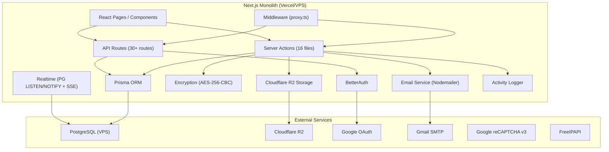
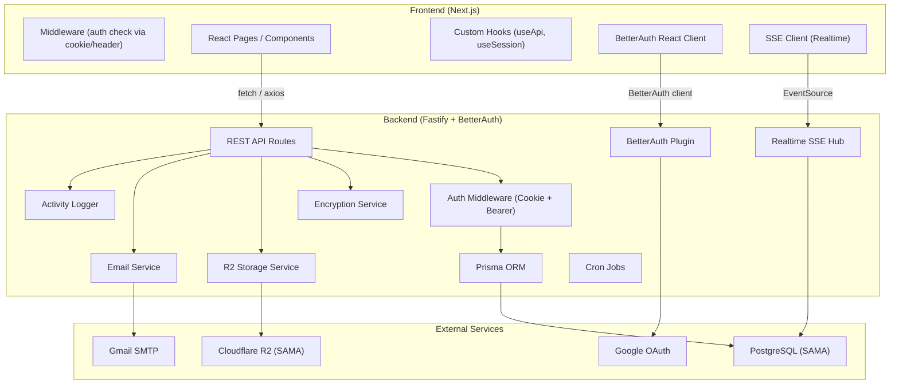
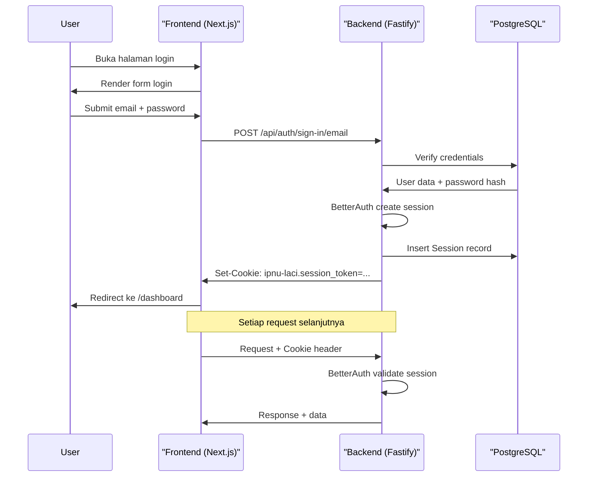
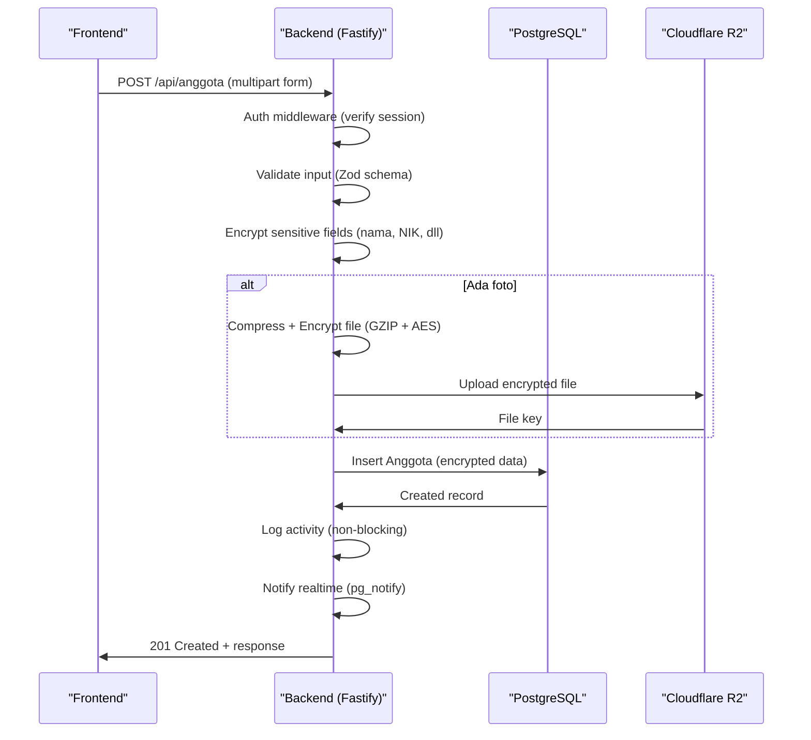
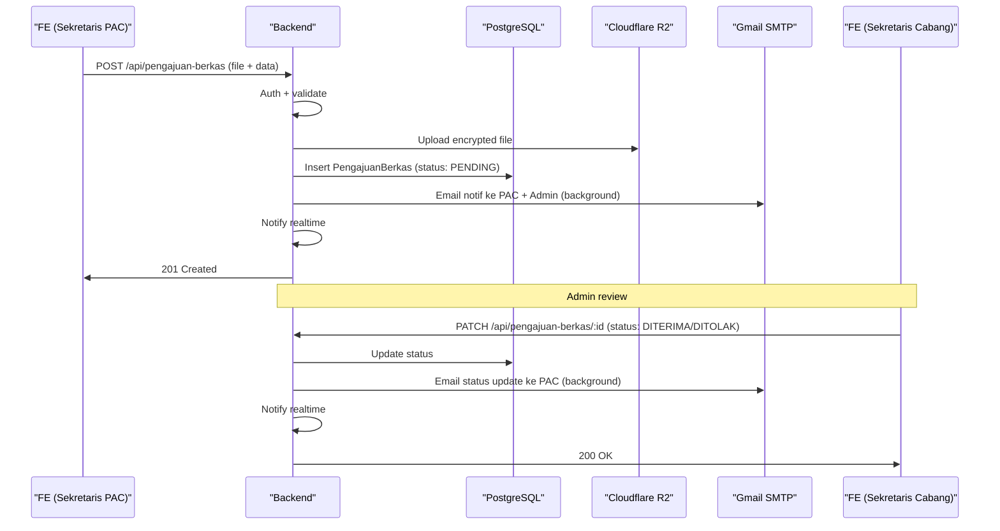

# PRD: Pemisahan Backend & Frontend — Laci Digital IPNU IPPNU Magetan

## Ringkasan Proyek

**Laci Digital** adalah sistem manajemen arsip & administrasi organisasi IPNU IPPNU Magetan yang saat ini dibangun sebagai **Next.js Fullstack** (monolith). Rencana ke depan adalah **memisahkan Backend (BE) dan Frontend (FE)** agar:
- BE bisa digunakan oleh multi-client (web, mobile)
- FE fokus pada UI/UX tanpa logika bisnis
- Maintainability dan skalabilitas lebih baik
- Data yang sudah ada di production **TIDAK BERUBAH** (zero data loss)

> [!CAUTION]
> Project ini sudah **PRODUCTION** dengan data aktif. Semua migrasi harus menjamin **kompatibilitas database 100%** — tidak boleh ada perubahan schema yang merusak data existing.

---

## 1. Analisis Sistem Saat Ini (As-Is)

### 1.1 Arsitektur Monolith Saat Ini



### 1.2 Database Schema (PostgreSQL via Prisma)

| Model | Deskripsi | Relasi Utama |
|-------|-----------|-------------|
| `User` | Akun pengguna (Sekretaris Cabang/PAC) | → Session, Account, semua modul |
| `Session` | Sesi login BetterAuth | → User |
| `Account` | Akun provider (credential/google) | → User |
| `Verification` | Token verifikasi email | - |
| `Periode` | Periode kepengurusan | → User, semua modul |
| `ArsipSurat` | Arsip surat masuk/keluar | → User, Periode |
| `BerkasSP` | Berkas Surat Penetapan | → User, Periode |
| `BerkasPimpinan` | Berkas dari pimpinan | → User, Periode |
| `PengajuanBerkas` | Pengajuan berkas PAC→Cabang | → User, Periode (2 relasi) |
| `Anggota` | Data anggota organisasi | → User, Periode, Perkaderan, Pendidikan |
| `Pendidikan` | Riwayat pendidikan anggota | → Anggota |
| `Perkaderan` | Riwayat perkaderan anggota | → Anggota |
| `AgendaKegiatan` | Agenda/kalender kegiatan | → User, Periode |
| `Presensi` | Event presensi kegiatan | → User, Periode |
| `PresensiData` | Data absensi peserta | → Presensi |
| `LogActivity` | Audit log aktivitas user | → User, Periode |
| `LogEmail` | Log pengiriman email | - |
| `AllowedOrigin` | Domain CORS yang diizinkan | - |

**Enums**: `Role`, `JenisSurat`, `Organisasi`, `StatusPengajuan`, `PenerimaSurat`, `JenisKelamin`, `LogAction`, `LogModule`, `EmailType`, `EmailStatus`

### 1.3 Authentication System (BetterAuth)

| Fitur | Detail |
|-------|--------|
| Email + Password | Enabled, `requireEmailVerification: false` |
| Google OAuth | Auto-link jika email match |
| Email OTP | 6 digit, 5 menit expiry |
| Session | Cookie-based, 6 jam expiry, refresh 1 jam |
| JWT (Mobile) | HS256, 24 jam expiry, validasi `lastLogoutAt` |
| Cookie Prefix | `ipnu-laci` |
| Cookie Cache | 5 menit |
| Role | `SEKRETARIS_CABANG`, `SEKRETARIS_PAC` |
| Custom Fields | `role`, `isActive`, `periodeAktifId`, `lastLogoutAt` |

### 1.4 Server Actions (16 Files — Logic Utama)

| File | Fungsi Utama | Kompleksitas |
|------|-------------|-------------|
| `auth-actions.ts` | Register, login, profile update, user management, reset password | 🔴 Tinggi |
| `anggota-actions.ts` | CRUD anggota + encrypt/decrypt + copy periode + stats | 🔴 Tinggi |
| `arsip-actions.ts` | CRUD arsip surat + file upload/download R2 + encrypt | 🔴 Tinggi |
| `pengajuan-berkas-actions.ts` | CRUD pengajuan + approval flow + email notif | 🔴 Tinggi (1349 lines) |
| `berkas-sp-actions.ts` | CRUD berkas SP + file R2 | 🟡 Sedang |
| `berkas-pimpinan-actions.ts` | CRUD berkas pimpinan + file R2 | 🟡 Sedang |
| `dashboard-actions.ts` | Statistik dashboard, leaderboard, monitoring | 🟡 Sedang |
| `presensi-actions.ts` | CRUD presensi + absensi publik | 🟡 Sedang |
| `log-activity-actions.ts` | Query log aktivitas + filter | 🟡 Sedang |
| `log-email-actions.ts` | Query log email + retry | 🟡 Sedang |
| `agenda-kegiatan-actions.ts` | CRUD agenda/kalender | 🟢 Rendah |
| `periode-actions.ts` | CRUD periode kepengurusan | 🟢 Rendah |
| `backup-actions.ts` | Backup data ke R2 | 🟢 Rendah |
| `view-periode-actions.ts` | Switch view periode (cookie) | 🟢 Rendah |
| `email-verification-actions.ts` | Trigger verifikasi email | 🟢 Rendah |
| `recaptcha-actions.ts` | Verifikasi reCAPTCHA | 🟢 Rendah |

### 1.5 API Routes (30+ Endpoints)

| Group | Endpoints | Method |
|-------|-----------|--------|
| `/api/auth/[...all]` | BetterAuth handler (login, register, session, OAuth) | GET, POST |
| `/api/auth/error` | Error handler | GET |
| `/api/anggota` | List, Create | GET, POST |
| `/api/anggota/[id]` | Detail, Update, Delete | GET, PUT, DELETE |
| `/api/anggota/[id]/image` | Foto anggota | GET |
| `/api/anggota/stats` | Statistik anggota | GET |
| `/api/arsip` | List, Create | GET, POST |
| `/api/arsip/[id]` | Detail, Update, Delete | GET, PUT, DELETE |
| `/api/arsip/download/[id]` | Download file arsip | GET |
| `/api/arsip/stats` | Statistik arsip | GET |
| `/api/berkas-sp` | CRUD + download + stats | GET, POST, PUT, DELETE |
| `/api/berkas-pimpinan` | CRUD + download + stats | GET, POST, PUT, DELETE |
| `/api/pengajuan-berkas` | CRUD + download + stats | GET, POST, PUT, DELETE |
| `/api/agenda-kegiatan` | CRUD | GET, POST, PUT, DELETE |
| `/api/presensi` | CRUD | GET, POST, PUT, DELETE |
| `/api/presensi/[id]/absensi` | Submit absensi publik | POST |
| `/api/periode` | CRUD | GET, POST, PUT, DELETE |
| `/api/dashboard/stats` | Dashboard statistik | GET |
| `/api/realtime` | SSE stream | GET |
| `/api/me` | Current user info | GET |
| `/api/logs` | Activity logs | GET |
| `/api/manajemen-user` | User management (Cabang only) | GET, POST, PUT, DELETE |
| `/api/manajemen-user/[id]/image` | User profile image | GET |
| `/api/docs` | Swagger/OpenAPI spec | GET |
| `/api/cron/backup` | Automated backup | POST |
| `/api/public/stats` | Public statistics | GET |
| `/api/public/phbi` | Hari besar Islam | GET |
| `/api/public/data` | Public data | GET |

### 1.6 Library & Service Layer

| Library | Fungsi | Pindah ke BE? |
|---------|--------|:---:|
| `lib/auth.ts` | BetterAuth config (234 lines) | ✅ |
| `lib/auth-session.ts` | Get session helper | ✅ (jadi middleware Fastify) |
| `lib/auth-client.ts` | BetterAuth React client | ❌ (tetap di FE) |
| `lib/prisma.ts` | Prisma client + realtime hooks | ✅ |
| `lib/encryption.ts` | AES-256-CBC encrypt/decrypt | ✅ |
| `lib/storage-r2.ts` | Cloudflare R2 operations | ✅ |
| `lib/email.ts` | Nodemailer SMTP + templates | ✅ |
| `lib/realtime.ts` | PG LISTEN/NOTIFY + SSE hub | ✅ |
| `lib/log-activity.ts` | Audit logging | ✅ |
| `lib/jwt.ts` | JWT create/verify (jose) | ✅ |
| `lib/api-auth.ts` | Dual auth (cookie+bearer) | ✅ (jadi middleware) |
| `lib/api-key.ts` | API key validation | ✅ |
| `lib/recaptcha.ts` | reCAPTCHA verification | ✅ |
| `lib/date-utils.ts` | Date utilities | ✅ |
| `lib/presensi-utils.ts` | Presensi time check | ✅ |
| `lib/swagger.ts` | OpenAPI spec | ✅ |
| `lib/utils.ts` | Generic utils (cn) | ❌ (tetap di FE) |
| `lib/email-templates/` | HTML email templates | ✅ |

### 1.7 Middleware (proxy.ts)

Saat ini middleware berjalan di **Edge Runtime** dan melakukan:
1. Cek cookie session sebelum fetch
2. Fetch `/api/auth/get-session` untuk validasi
3. Redirect ke login jika tidak authenticated
4. Block akses fitur jika email belum verified
5. Redirect ke dashboard jika sudah login

### 1.8 Dashboard Pages (15 Modul)

| Modul | Halaman | Role Akses |
|-------|---------|-----------|
| Dashboard | `/dashboard` | Semua |
| Anggota | `/dashboard/anggota` | Semua |
| Arsip Surat | `/dashboard/arsip` | Semua |
| Berkas SP | `/dashboard/berkas-sp` | Semua |
| Berkas Pimpinan | `/dashboard/berkas-pimpinan` | Semua |
| Pengajuan Berkas | `/dashboard/pengajuan-berkas` | Semua |
| Referensi Pengajuan | `/dashboard/referensi-pengajuan` | PAC |
| Agenda Kegiatan | `/dashboard/agenda-kegiatan` | Semua |
| Presensi | `/dashboard/presensi` | Semua |
| Periode | `/dashboard/periode` | Semua |
| Profile | `/dashboard/profile` | Semua |
| Manajemen User | `/dashboard/manajemen-user` | Cabang only |
| Log Activity | `/dashboard/log-activity` | Semua |
| Log Email | `/dashboard/log-email` | Cabang only |
| Audit Log | `/dashboard/audit-log` | Cabang only |
| Backup | `/dashboard/backup` | Cabang only |

### 1.9 External Services & Environment Variables

| Service | Env Variables | Pindah ke |
|---------|--------------|-----------|
| PostgreSQL | `DATABASE_URL`, `DIRECT_URL` | BE |
| BetterAuth | `BETTER_AUTH_SECRET`, `BETTER_AUTH_URL` | BE |
| Google OAuth | `GOOGLE_CLIENT_ID`, `GOOGLE_CLIENT_SECRET` | BE |
| Encryption | `ENCRYPTION_KEY` | BE |
| reCAPTCHA | `RECAPTCHA_SECRET_KEY` | BE |
| SMTP | `SMTP_HOST`, `SMTP_PORT`, `SMTP_USER`, `SMTP_PASS` | BE |
| Cloudflare R2 | `R2_ACCOUNT_ID`, `R2_ACCESS_KEY_ID`, `R2_SECRET_ACCESS_KEY`, `R2_BUCKET_NAME` | BE |
| API Key | `API_KEY` | BE |
| Cron | `CRON_SECRET` | BE |
| Admin Email | `ADMIN_NOTIFICATION_EMAIL` | BE |
| Frontend URL | `NEXT_PUBLIC_APP_URL`, `NEXT_PUBLIC_RECAPTCHA_SITE_KEY` | FE |

---

## 2. Arsitektur Target (To-Be)

### 2.1 Diagram Arsitektur Baru



### 2.2 Stack Teknologi

| Layer | Saat Ini | Target |
|-------|----------|--------|
| **Frontend** | Next.js (fullstack) | Next.js (FE only) — tanpa server actions |
| **Backend** | Embedded di Next.js | **Fastify** + **BetterAuth** |
| **Database** | PostgreSQL + Prisma | PostgreSQL + Prisma (**SAMA, database SAMA**) |
| **Auth** | BetterAuth di Next.js | BetterAuth di Fastify |
| **Storage** | Cloudflare R2 | Cloudflare R2 (**SAMA**) |
| **Email** | Nodemailer | Nodemailer (**SAMA**) |
| **Realtime** | PG LISTEN/NOTIFY + SSE | PG LISTEN/NOTIFY + SSE (**SAMA**) |
| **Deployment** | Vercel / VPS | FE: Vercel, BE: VPS (Docker) |

---

## 3. Apa yang Perlu Disiapkan

### 3.1 Backend (Fastify + BetterAuth) — Project Baru

#### A. Setup Project

```
laci-api/
├── src/
│   ├── index.ts                    # Fastify entry point
│   ├── config/
│   │   ├── env.ts                  # Environment validation (zod)
│   │   └── cors.ts                 # CORS configuration
│   ├── plugins/
│   │   ├── auth.ts                 # BetterAuth plugin untuk Fastify
│   │   ├── prisma.ts               # Prisma plugin
│   │   ├── realtime.ts             # SSE / realtime plugin
│   │   └── swagger.ts              # Swagger/OpenAPI docs
│   ├── middleware/
│   │   ├── auth.middleware.ts       # Session + Bearer token auth
│   │   ├── role.middleware.ts       # Role-based access control
│   │   └── rate-limit.middleware.ts # Rate limiting
│   ├── services/
│   │   ├── encryption.service.ts    # AES-256-CBC (COPY EXACT dari lib/encryption.ts)
│   │   ├── storage.service.ts       # R2 operations (COPY EXACT dari lib/storage-r2.ts)
│   │   ├── email.service.ts         # Nodemailer (COPY EXACT dari lib/email.ts)
│   │   ├── log.service.ts           # Activity logger (ADAPTASI dari lib/log-activity.ts)
│   │   ├── jwt.service.ts           # JWT (COPY EXACT dari lib/jwt.ts)
│   │   └── recaptcha.service.ts     # reCAPTCHA (COPY EXACT)
│   ├── routes/
│   │   ├── auth/                    # BetterAuth routes
│   │   ├── anggota/                 # CRUD + search + stats + export
│   │   ├── arsip/                   # CRUD + file upload/download
│   │   ├── berkas-sp/               # CRUD + file
│   │   ├── berkas-pimpinan/         # CRUD + file
│   │   ├── pengajuan-berkas/        # CRUD + approval + email
│   │   ├── agenda-kegiatan/         # CRUD
│   │   ├── presensi/                # CRUD + public absensi
│   │   ├── periode/                 # CRUD
│   │   ├── dashboard/               # Stats & monitoring
│   │   ├── user-management/         # Admin user CRUD
│   │   ├── logs/                    # Activity & email logs
│   │   ├── backup/                  # Backup operations
│   │   ├── realtime/                # SSE endpoint
│   │   ├── me/                      # Current user info
│   │   └── public/                  # Public endpoints (stats, PHBI)
│   ├── schemas/                     # Zod / JSON Schema validation
│   │   ├── anggota.schema.ts
│   │   ├── arsip.schema.ts
│   │   ├── auth.schema.ts
│   │   └── ...
│   ├── email-templates/             # COPY dari src/lib/email-templates/
│   │   ├── verification.ts
│   │   ├── verified-success.ts
│   │   ├── pengajuan-berkas.ts
│   │   └── pengajuan-berkas-status.ts
│   └── utils/
│       ├── date.ts                  # COPY dari lib/date-utils.ts
│       └── presensi.ts              # COPY dari lib/presensi-utils.ts
├── prisma/
│   └── schema.prisma                # COPY EXACT dari project sekarang
├── .env
├── package.json
├── tsconfig.json
├── Dockerfile
└── docker-compose.yml
```

#### B. Dependencies Utama

```json
{
  "dependencies": {
    "fastify": "^5.x",
    "@fastify/cors": "^10.x",
    "@fastify/cookie": "^11.x",
    "@fastify/multipart": "^9.x",
    "@fastify/rate-limit": "^10.x",
    "@fastify/swagger": "^9.x",
    "@fastify/swagger-ui": "^5.x",
    "better-auth": "1.5.6",
    "@prisma/client": "^6.19.2",
    "@aws-sdk/client-s3": "^3.x",
    "@aws-sdk/s3-request-presigner": "^3.x",
    "nodemailer": "^6.9.16",
    "jose": "^5.x",
    "zod": "^4.x",
    "pg": "^8.x",
    "bcryptjs": "^3.x",
    "xlsx": "^0.18.5",
    "xlsx-js-style": "^1.2.0"
  }
}
```

#### C. BetterAuth di Fastify — Konfigurasi Kritis

> [!IMPORTANT]
> BetterAuth config harus **IDENTIK** dengan yang ada di Next.js saat ini agar session & akun tetap kompatibel. Berikut yang harus **PERSIS SAMA**:

| Setting | Nilai | Alasan |
|---------|-------|--------|
| `secret` | `BETTER_AUTH_SECRET` (env sama) | Agar cookie & token bisa di-decode |
| `advanced.cookiePrefix` | `"ipnu-laci"` | Cookie name harus match |
| `advanced.useSecureCookies` | `true` | Konsisten dengan production |
| `session.expiresIn` | `60 * 60 * 6` (6 jam) | Session length sama |
| `session.updateAge` | `60 * 60` (1 jam) | Refresh interval sama |
| `session.cookieCache.maxAge` | `5 * 60` (5 menit) | Cache sama |
| `user.additionalFields` | `role`, `isActive`, `periodeAktifId`, `lastLogoutAt` | Field custom sama |
| `database adapter` | Prisma + PostgreSQL | Database SAMA |
| `plugins` | `emailOTP` (length: 6, expiry: 5min) | OTP config sama |
| `socialProviders.google` | Client ID/Secret SAMA | OAuth SAMA |
| `emailAndPassword.requireEmailVerification` | `false` | Behaviour SAMA |
| `account.autoLink` | `true`, trusted: `["google"]` | Auto-link SAMA |

#### D. API Endpoint Mapping (Server Actions → REST API)

Semua server actions perlu dikonversi menjadi REST API endpoints:

**Auth & User Management:**
| Server Action | REST Endpoint | Method |
|--------------|---------------|--------|
| BetterAuth built-in | `/api/auth/**` | GET/POST |
| `updateProfile()` | `/api/me/profile` | PUT |
| `resetUserPassword()` | `/api/users/:id/reset-password` | POST |
| `toggleUserStatus()` | `/api/users/:id/toggle-status` | PATCH |
| `deleteUser()` | `/api/users/:id` | DELETE |
| `getPACUsers()` | `/api/users?role=PAC` | GET |
| `getUserStats()` | `/api/users/stats` | GET |
| `getUserDetail()` | `/api/users/:id` | GET |

**Anggota:**
| Server Action | REST Endpoint | Method |
|--------------|---------------|--------|
| `getAnggotaList()` | `/api/anggota` | GET |
| `getAnggotaById()` | `/api/anggota/:id` | GET |
| `createAnggota()` | `/api/anggota` | POST |
| `updateAnggota()` | `/api/anggota/:id` | PUT |
| `deleteAnggota()` | `/api/anggota/:id` | DELETE |
| `getAnggotaStats()` | `/api/anggota/stats` | GET |
| `copyAnggotaToCurrentPeriode()` | `/api/anggota/copy` | POST |
| `getActiveUsers()` | `/api/anggota/users` | GET |

**Arsip Surat:**
| Server Action | REST Endpoint | Method |
|--------------|---------------|--------|
| `getArsipSurats()` | `/api/arsip` | GET |
| `createArsipSurat()` | `/api/arsip` | POST (multipart) |
| `updateArsipSurat()` | `/api/arsip/:id` | PUT (multipart) |
| `deleteArsipSurat()` | `/api/arsip/:id` | DELETE |
| Download file | `/api/arsip/:id/download` | GET |

**Pattern yang sama untuk:** Berkas SP, Berkas Pimpinan, Pengajuan Berkas, Agenda Kegiatan, Presensi, Periode, Log Activity, Log Email, Dashboard, Backup.

#### E. Encryption Compatibility

> [!CAUTION]
> **ENCRYPTION_KEY dan algoritma harus IDENTIK** karena data di database sudah terenkripsi dengan AES-256-CBC. Jika berbeda, semua data anggota (nama, NIK, alamat, dll) tidak bisa didekripsi.

Yang harus di-copy **PERSIS** ke BE:
- Algorithm: `aes-256-cbc`
- IV Length: 16 bytes
- Key derivation: `crypto.scryptSync(ENCRYPTION_KEY, "laci-ipnu-ippnu-salt-2025", 32)`
- Text format: `iv_hex:encrypted_hex`
- File format: `iv_bytes + encrypted_compressed_bytes` (GZIP + AES)

#### F. Realtime System

Arsitektur realtime tetap sama:
1. **PG LISTEN/NOTIFY** channel: `laci_realtime`
2. **SSE endpoint**: `/api/realtime` — streaming events ke client
3. **Notify trigger**: Dipanggil setelah setiap mutasi data
4. Di Fastify, gunakan `reply.raw` untuk SSE streaming

---

### 3.2 Frontend (Next.js) — Modifikasi Project Ini

#### A. Yang Harus DIHAPUS dari FE

| Item | Lokasi | Alasan |
|------|--------|--------|
| Semua Server Actions | `src/app/actions/*.ts` (16 files) | Diganti API call ke BE |
| API Routes | `src/app/api/**` (30+ routes) | Pindah ke BE |
| Prisma | `prisma/`, `src/lib/prisma.ts` | Database diakses via BE |
| BetterAuth Server | `src/lib/auth.ts` | Auth handler di BE |
| Auth Session | `src/lib/auth-session.ts` | Session via API BE |
| Encryption | `src/lib/encryption.ts` | Enkripsi di BE |
| Storage R2 | `src/lib/storage-r2.ts` | Storage via BE |
| Email | `src/lib/email.ts`, `email-templates/` | Email via BE |
| Realtime Server | `src/lib/realtime.ts` (listener part) | SSE dari BE |
| Log Activity | `src/lib/log-activity.ts` | Logging via BE |
| JWT | `src/lib/jwt.ts` | JWT di BE |
| API Auth | `src/lib/api-auth.ts` | Auth middleware di BE |
| API Key | `src/lib/api-key.ts` | Validasi di BE |
| reCAPTCHA server | `src/lib/recaptcha.ts` | Verifikasi di BE |
| Swagger | `src/lib/swagger.ts` | Docs di BE |
| Compatibility | `src/auth.ts` | Tidak perlu lagi |
| Package deps | prisma, @prisma/client, @aws-sdk/*, nodemailer, pg, bcryptjs, jose | Tidak dipakai FE |

#### B. Yang Harus DITAMBAH/DIUBAH di FE

**1. API Client Layer (`src/lib/api-client.ts`)**
```typescript
// Centralized API client yang menangani:
// - Base URL ke Fastify BE
// - Cookie forwarding (BetterAuth session)
// - Error handling
// - Response typing
// - Interceptors (refresh token, etc.)
```

**2. Custom Hooks (`src/hooks/useApi.ts`)**
```typescript
// React hooks untuk:
// - Data fetching (SWR/React Query)
// - Mutations
// - Loading & error states
// - Optimistic updates
// - Cache invalidation
```

**3. BetterAuth Client Update (`src/lib/auth-client.ts`)**
```typescript
// Update baseURL ke Fastify BE URL
export const authClient = createAuthClient({
  baseURL: process.env.NEXT_PUBLIC_API_URL, // Fastify BE URL
  // ... config sama
});
```

**4. Middleware Update (`src/proxy.ts` / `middleware.ts`)**
```typescript
// Update middleware agar fetch session dari Fastify BE
// Ganti: fetch(`${internalUrl}/api/auth/get-session`)
// Jadi:  fetch(`${BACKEND_URL}/api/auth/get-session`)
```

**5. Environment Variables Baru**
```env
# Frontend .env
NEXT_PUBLIC_API_URL=https://api.laci.pelajarnumagetan.or.id  # Fastify BE URL
NEXT_PUBLIC_APP_URL=https://laci.pelajarnumagetan.or.id      # FE URL (tetap)
NEXT_PUBLIC_RECAPTCHA_SITE_KEY=...                            # tetap
```

**6. SSE Client Update**
```typescript
// Update EventSource URL ke Fastify BE
new EventSource(`${process.env.NEXT_PUBLIC_API_URL}/api/realtime`);
```

#### C. Yang TETAP SAMA di FE

| Item | Lokasi | Alasan |
|------|--------|--------|
| React Components | `src/components/` | UI tidak berubah |
| Pages/Layouts | `src/app/(sistem)/` | Routing tetap |
| Auth Client | `src/lib/auth-client.ts` | Update baseURL saja |
| CSS/Styles | `src/app/globals.css` | Tampilan tetap |
| UI Library | shadcn/ui, Radix, Recharts, FullCalendar | UI deps tetap |
| Static Assets | `public/` | Tetap |
| Types | `src/types/` | Update sesuai API response |
| SEO | `robots.ts`, `sitemap.ts` | Tetap |
| Error Pages | `error.tsx`, `not-found.tsx` | Tetap |
| Utils | `src/lib/utils.ts` (cn function) | Tetap |
| Date Utils | `src/lib/date-utils.ts` | Bisa tetap untuk format display |

---

## 4. Alur Kerja Sistem Baru

### 4.1 Alur Autentikasi



### 4.2 Alur CRUD dengan Enkripsi (Contoh: Anggota)



### 4.3 Alur Pengajuan Berkas + Email Notification



### 4.4 Alur Cookie Cross-Origin (KRITIS)

> [!WARNING]
> Karena FE dan BE berjalan di **domain berbeda**, cookie BetterAuth harus dikonfigurasi dengan benar:

```
FE Domain: laci.pelajarnumagetan.or.id
BE Domain: api.laci.pelajarnumagetan.or.id
Cookie Domain: .pelajarnumagetan.or.id (shared parent domain)
```

**Konfigurasi yang diperlukan:**

| Setting | Nilai |
|---------|-------|
| Cookie `domain` | `.pelajarnumagetan.or.id` |
| Cookie `sameSite` | `none` |
| Cookie `secure` | `true` |
| Cookie `httpOnly` | `true` |
| CORS `origin` | `https://laci.pelajarnumagetan.or.id` |
| CORS `credentials` | `true` |
| Fetch `credentials` | `include` |

**BetterAuth Fastify Config:**
```typescript
const auth = betterAuth({
  // ... same config
  advanced: {
    useSecureCookies: true,
    cookiePrefix: "ipnu-laci",
    crossSubDomainCookies: {
      enabled: true,
      domain: ".pelajarnumagetan.or.id",
    },
  },
  trustedOrigins: [
    "https://laci.pelajarnumagetan.or.id",
    "http://localhost:3000",  // dev
  ],
});
```

---

## 5. Strategi Migrasi (Zero-Downtime)

### Phase 1: Setup Backend Fastify (Paralel, Tidak Mengganggu Production)

1. Buat project baru `laci-api`
2. Setup Fastify + BetterAuth + Prisma (schema COPY dari project ini)
3. Implementasi semua REST API endpoints
4. Copy semua services (encryption, R2, email, realtime, logging)
5. Testing dengan database **DEVELOPMENT** dulu

### Phase 2: Validasi Kompatibilitas

1. Point BE ke **database PRODUCTION** (read-only test)
2. Verifikasi semua data bisa di-decrypt dengan benar
3. Verifikasi session/cookie kompatibilitas
4. Verifikasi Google OAuth flow

### Phase 3: Modifikasi Frontend

1. Buat API client layer
2. Ganti semua server actions → API calls
3. Update middleware
4. Update BetterAuth client baseURL
5. Update SSE client
6. Hapus semua backend code dari FE
7. Testing end-to-end

### Phase 4: Deployment

1. Deploy BE Fastify di VPS (Docker)
2. Setup Nginx reverse proxy untuk BE (`api.laci.pelajarnumagetan.or.id`)
3. Deploy FE yang sudah dimodifikasi
4. Setup DNS untuk subdomain API
5. Monitor selama 24-48 jam
6. Jika stabil, matikan old monolith

### Timeline Estimasi

| Phase | Durasi | Risiko |
|-------|--------|--------|
| Phase 1 | 2-3 minggu | Rendah |
| Phase 2 | 2-3 hari | Sedang (kompatibilitas data) |
| Phase 3 | 1-2 minggu | Sedang (banyak file berubah) |
| Phase 4 | 1-2 hari | Tinggi (production switch) |

---

## 6. Checklist Persiapan

### Backend (Fastify) ✅ Checklist

- [ ] Project scaffolding (Fastify + TypeScript)
- [ ] BetterAuth plugin (config identik)
- [ ] Prisma setup (schema COPY, database sama)
- [ ] CORS configuration (cross-subdomain cookie)
- [ ] Auth middleware (cookie + bearer token)
- [ ] Role middleware (SEKRETARIS_CABANG / SEKRETARIS_PAC)
- [ ] Encryption service (COPY EXACT)
- [ ] R2 storage service (COPY EXACT)
- [ ] Email service + templates (COPY EXACT)
- [ ] Realtime SSE hub (PG LISTEN/NOTIFY)
- [ ] Activity logger service
- [ ] JWT service (COPY EXACT)
- [ ] reCAPTCHA verification
- [ ] Rate limiting
- [ ] Swagger/OpenAPI documentation
- [ ] All CRUD routes (15 modul)
- [ ] File upload/download routes (multipart)
- [ ] Dashboard stats routes
- [ ] Public routes (no auth)
- [ ] Cron backup route
- [ ] Docker setup
- [ ] Unit tests
- [ ] Integration tests

### Frontend (Next.js) ✅ Checklist

- [ ] API client layer (`src/lib/api-client.ts`)
- [ ] Update `auth-client.ts` baseURL
- [ ] Update middleware (`proxy.ts`)
- [ ] Custom hooks (`useApi`, `useMutation`)
- [ ] Ganti semua server action imports → API calls
- [ ] Update SSE client URL
- [ ] Update environment variables
- [ ] Hapus backend dependencies dari `package.json`
- [ ] Hapus semua backend files
- [ ] Testing semua halaman
- [ ] Build test (pastikan no broken imports)

---

## Open Questions

> [!IMPORTANT]
> **Q1**: Apakah BE akan di-deploy di VPS yang sama dengan database PostgreSQL saat ini, atau VPS terpisah?
> Ini mempengaruhi latency database dan konfigurasi jaringan.

> [!IMPORTANT]
> **Q2**: Untuk domain BE, apakah menggunakan subdomain `api.laci.pelajarnumagetan.or.id` atau domain terpisah?
> Ini sangat mempengaruhi konfigurasi cookie cross-origin.

> [!IMPORTANT]
> **Q3**: Apakah ingin langsung mulai dari implementasi BE (Phase 1) dulu, atau mau saya siapkan boilerplate project Fastify-nya terlebih dahulu?

> [!NOTE]
> **Q4**: Apakah ada rencana mobile app yang juga akan menggunakan API ini? Jika iya, perlu dipertimbangkan token-based auth (JWT) sebagai primary auth untuk mobile, bukan cookie.

> [!NOTE]
> **Q5**: Selama masa transisi, apakah kedua sistem (monolith lama + FE+BE baru) perlu berjalan bersamaan? Jika iya, perlu strategi blue-green deployment.
